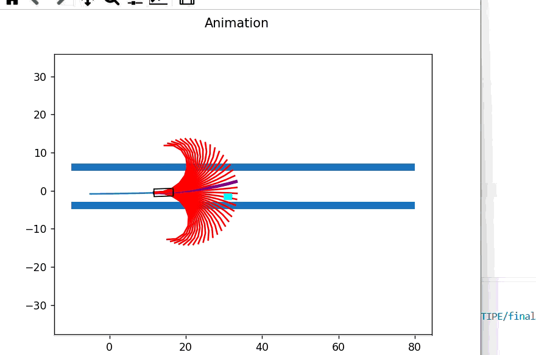

# Autonomous Navigation with Tentacles Method (TIPE)

Projet d'Initiative Personnelle Encadrée (TIPE) réalisé en CPGE (Lycée Sainte-Geneviève) sur le thème national **« La Ville »**.

Ce projet propose une implémentation et une simulation Python d'un algorithme réactif d'évitement d'obstacles et de planification locale de trajectoire pour véhicule autonome, basé sur la **méthode des tentacules** [[1]](#ref-1).



---

## 📌 Présentation du Projet

L'objectif principal est d'assurer la navigation sécurisée d'un véhicule évoluant en milieu urbain contraint sans recourir à une cartographie globale lourde (type SLAM).

Face aux limitations d'une approche initiale discrète par matrice d'occupation en pixels (lenteur calculatoire et imprécision géométrique), le projet a évolué vers une architecture modélisée en **programmation orientée objet (POO)** :
- **Génération de trajectoires primitives (tentacules) :** échantillonnage continu sous forme d'**arcs de cercle** [[1]](#ref-1) puis de **clothoïdes** calculées par intégrales de Fresnel (`scipy.integrate.quad`) [[2]](#ref-2) [[3]](#ref-3).
- **Validation géométrique de navigabilité :** construction de corridors de sécurité polygonaux via `shapely` (zones de support et distances d'arrêt dépendantes de la dynamique du véhicule).
- **Sélection dynamique optimale :** choix en temps réel du meilleur tentacule minimisant les variations de braquage et l'écart à la trajectoire cible, tout en évitant les collisions.
- **Visualisation dynamique interactive :** animation temps réel vectorielle via `matplotlib.animation` (avec suivi télémétrique simultané de la vitesse et de l'angle de braquage).

---

## 📐 Modélisation Théorique & Mathématique

### 1. Primitives géométriques : Clothoïdes & Intégrales de Fresnel
Afin d'assurer la continuité de la courbure $\kappa(s)$ et d'éviter les discontinuités d'accélération latérale au volant, les trajectoires candidates adoptent un profil clothoïdaire paramétré par l'abscisse curviligne $s$ :

$$\kappa(s) = \kappa_0 + \frac{\Delta\kappa}{\Delta l} s$$

Les coordonnées cartésiennes $(x(t), y(t))$ dans le repère local du véhicule sont obtenues par quadrature numérique :

$$x(t) = \int_{0}^{t} \cos\left(\frac{1}{2} \frac{\Delta\kappa}{\Delta l} s^2 + \kappa_{\text{finale}} s\right) \, ds$$

$$y(t) = \int_{0}^{t} \sin\left(\frac{1}{2} \frac{\Delta\kappa}{\Delta l} s^2 + \kappa_{\text{finale}} s\right) \, ds$$

### 2. Modèle bicyclette dynamique & Contraintes cinématiques
Pour relier la courbure admissible aux capacités physiques du véhicule, nous exploitons le modèle bicyclette linéaire [[4]](#ref-4) sous contrainte d'accélération latérale maximale $a_{\text{lat, max}}$ :

$$\rho_{\max} = \frac{a_{\text{lat, max}}}{V_x^2} \quad \Longrightarrow \quad \delta_{\max} = \arctan(L \cdot \rho_{\max})$$

Les efforts transversaux aux pneumatiques reposent sur les formulations de dérive de Pacejka [[5]](#ref-5).

### 3. Corridors de sécurité et décision
- **Distance de collision (freinage d'urgence) :** $d_c = \frac{V_x^2}{2 a_{\text{long, max}}} + \frac{L}{2}$
- **Fonction de coût de sélection :** tri des tentacules navigables selon une fonction de pénalité privilégiant la continuité de braquage :
  $$J = V_{\text{lisse}}^4 + \delta_{\text{braquage}}^2$$

---

## 📂 Structure du Répertoire

```text
├── main.py                    # Script principal (simulation complète avec clothoïdes & télémétrie)
├── README.md                  # Présentation du projet
├── LICENSE                    # Licence open source (MIT)
├── requirements.txt           # Dépendances Python
├── assets/                    # Captures d'écran et animations (GIFs, PNGs)
├── docs/                      # Supports de soutenance du TIPE
│   ├── Presentation_Orale.pdf # Diapositives de présentation
│   └── MCOT_23764.pdf         # Mise en Cohérence des Objectifs du TIPE
│   └── Python_codes_TIPE.pdf  # Ensemble des codes rédigés lors du projet, suivant la même continuité logique adoptée lors de nos travaux
└── tex-report/                # Rapport technique écrit au format tex
```

## ⚙️ Installation & Utilisation

### Prérequis
Python 3.8+ avec les bibliothèques scientifiques standards.

### Installation
```bash
git clone [https://github.com/](https://github.com/)ad-lerondl/TIPE_autonomous-vehicle.git
cd TIPE_autonomous-vehicle
pip install -r requirements.txt
```

### Lancement de la simulation
```bash
python main.py
```

### Contrôles interactifs :
- Appuyez sur n'importe quelle touche du clavier pour mettre la simulation en Pause / Play.
- La fenêtre 1 affiche la trajectoire du véhicule, les corridors de sécurité polygonaux et les tentacules candidats.
- La fenêtre 2 trace en temps réel l'évolution de la vitesse calculée et de l'angle de braquage du volant.


## 📄 Rapport & Présentation
Le rapport d'étude complet ainsi que le support d'oral sont consultables directement :

- Rapport technique (PDF) (Sources LaTeX disponibles dans le dossier report/)
- Présentation orale (PDF)
- MCOT officielle (PDF)

## 📚 Références bibliographiques

<a id="ref-1"></a>[1]. **F. von Hundelshausen, M. Himmelsbach, F. Hecker, A. Mueller, H.-J. Wuensche**,  
   *Driving with Tentacles: Integral Structures for Sensing and Motion*,  
   Journal of Field Robotics, vol. 25, n° 9, pp. 640–673, 2008.  
   DOI : [10.1002/rob.20256](https://doi.org/10.1002/rob.20256)

<a id="ref-2"></a>[2]. **M. Himmelsbach, T. Luettel, F. Hecker, F. von Hundelshausen, H.-J. Wuensche**,  
   *Autonomous Off-Road Navigation for MuCAR-3: Improving the Tentacles Approach: Integral Structures for Sensing and Motion*,  
   KI - Künstliche Intelligenz, vol. 25, n° 2, pp. 143–148, 2011.  
   DOI : [10.1007/s13218-011-0091-1](https://doi.org/10.1007/s13218-011-0091-1)

<a id="ref-3"></a>[3]. **G. Tagne Fokam**,  
   *Commande et planification de trajectoires pour la navigation de véhicules autonomes*,  
   Thèse de doctorat, Université de Technologie de Compiègne (UTC), 2014.  
   Archive ouverte : [HAL Id: tel-01160233](https://tel.archives-ouvertes.fr/tel-01160233)

<a id="ref-4"></a>[4]. **R. Rajamani**,  
   *Vehicle Dynamics and Control*, Mechanical Engineering Series,  
   Springer, New York, 2006 (e-ISBN: 0-387-28823-6).  
   DOI : [10.1007/978-0-387-28823-6](https://doi.org/10.1007/978-0-387-28823-6)

<a id="ref-5"></a>[5]. **H. B. Pacejka**,  
   *Tyre and Vehicle Dynamics*, 2nd Edition,  
   Elsevier / Butterworth-Heinemann, 2006 (ISBN: 978-0-7506-6918-4).  
   DOI : [10.1016/B978-0-7506-6918-4.X5000-X](https://doi.org/10.1016/B978-0-7506-6918-4.X5000-X)
